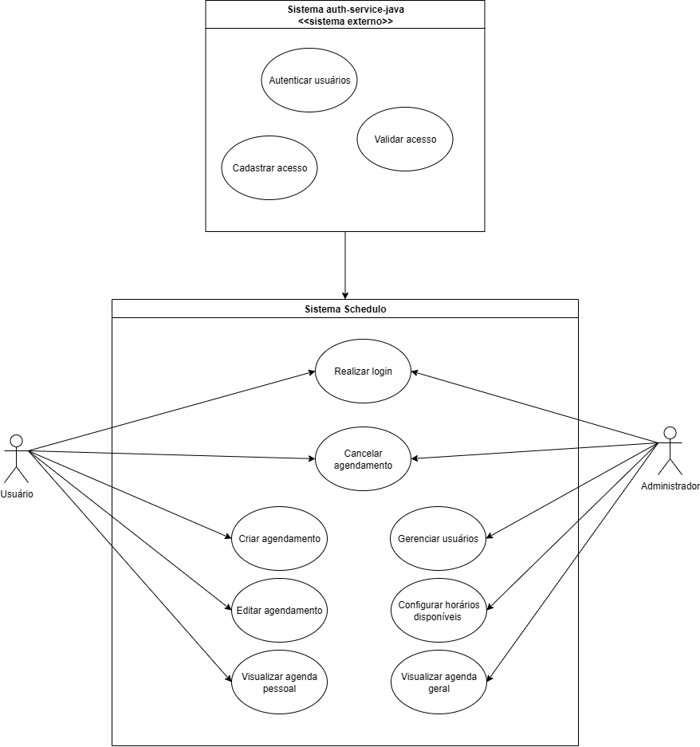

# Schedule — Sistema de Agendamento

🚧 **Status:** Em andamento

---

Projeto em desenvolvimento para agendamento e gerenciamento de eventos, tarefas ou processos, pensado para ser integrado a múltiplos sistemas e aplicações.

Este sistema oferece uma API RESTful construída com Java 21, Spring Boot e PostgreSQL, focada em fornecer uma solução escalável e flexível para controle de agendamentos e gerenciamento relacionados.

---

### Diagramas do Sistema

- Diagrama de Caso de Uso  
    

- Diagrama de Classes  
    

---

### Funcionalidades previstas

- Criação, edição e cancelamento de agendamentos  
- Gerenciamento das informações relacionadas aos agendamentos  
- Notificações e lembretes para os usuários  
- API REST para integração com front-end e aplicações diversas  

---

### Tecnologias usadas

- Java 21  
- Spring Boot  
- PostgreSQL  
